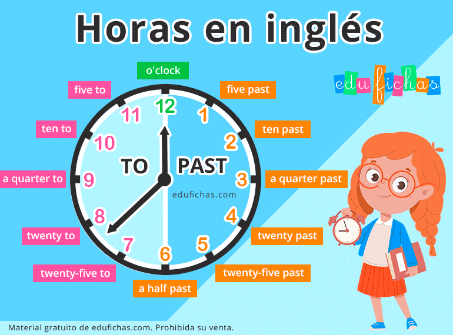

# Basico #3

## Pasado Progresivo o Continuo
#### Como convertir el verbo “TO BE” en pasado
- En el presente tenemos tres grupos, pero en el pasado se reducen a dos grupos: WAS Y WERE .
- Los pronombres singulares van en el grupo de WAS.
- Los pronombres plurales en el grupo de WERE
  
|  To Be Presente  |  To be Pasado  |
| - | - | 
| AM (I) | WAS (I) | 
| ARE (YOU , WE , THEY) | WERE (YOU , WE , THEY) | 
| IS (HE , SHE IT) | WAS (HE , SHE , IT) | 

:::tip Recordatorio
El verbo “to be” significa “ser” o “estar”.
:::

#### Frase #01
| INGLES |  ESPAÑOL |
| - | - | 
| I WAS  | Significa “Yo era” o “Yo estaba”. | 

:::tip Observación
- El Was/Were se utiliza para hablar del “pasado” (de algo que ya paso). 
- Para saber que significa, analizamos el complemento: PRONOMBRE + TO BE (WAS / WERE) + COMPLEMENTO
:::

#### Mas frases
| INGLES |  ESPAÑOL |
| - | - | 
| I WAS A CHEF  | Yo era un chef. | 
| I WAS IN THE KITCHEN | Yo estaba en la cocina. | 
| THEY WERE FRIENDS  | Ellos fueron amigos. | 
| THEY WERE AT THE PARK   | Ellos estaban en el parque | 

:::warning
EL TO BE en pasado no tiene forma corta
:::

#### Mas frases

| ESPAÑOL |  INGLES |
| - | - | 
| Ella fue mi novia/amiga  | She was my girldfriend / girl friend. | 

:::warning
- Girl friend separado significa amiga , pero todo junto significa  novia
- Lo mismo pasa con amigo/novio , “boy friend” no es lo mismo que “boyfriend”.
:::

:::tip ALTERNATIVAS
- Male friend : Amigo
- Female Friend : Amiga
:::

| ESPAÑOL |  INGLES |
| - | - | 
| Adam y Nelly estuvieron hablando inglés  | Adam and Nelly were speaking English | 
| Luz o Marta estuvo roncando anoche  | Luz or Marta    was         snoring last night | 
|   | I    was at the bank  but my parents were in the bank | 
|   | Charlie was sweeping the floor. | 
|   | I  am learning a new topic now. | 

:::tip Observacion
- Se sigue utilizando el “ING” del [Present Continuo](/documentacion_ingles/docs/Principiante/basico2#present-simple) con las mismas reglas.
- El conector “Y” une dos personas y por lo tanto es “plural”
- El conector “O” separa y por lo tanto es "singular"
- El adverbio “now” se refiere al presente y por lo tanto no se puede utilizar el “to be” en pasado.

:::

## Uso de While 

- While se utiliza como un conector 
- Significados:
   - While : Mientras / Aunque / Mientras que
   - A while : Un rato
   - A Little while : Un ratico/ratito
   - Once in a while : De vez en cuando.

:::tip Disminutivo
- La palabra “Little” hace el diminutivo del sustantivo que tenemos adelante.
- Ej:
  - Little dog = perrito
  - Little window = Ventanita

:::

#### Frases
| Español |  Ingles  |
| - | - |
|  Anoche mientras tu estabas manejando yo estaba durmiendo | Last night while you were driving, I was sleeping  |
|  Yo estaba estudiando ingles un rato mientras estaba escuchando música. | I was studying English a while, while   I was listing to music  |
|  Estuve estudiando inglés un rato, mientras escuchaba música. | I was studying English a while, while listening to music.  |
|  Ana estuvo trabajando un ratico mientras él estuvo cocinado. | Ana was working a little while, while he was cooking.  |

:::tip Observación
- Cuando se refiere a países o dias, se escribe con la primera letra en Mayúscula.
- Si se repite la palabra “while” no importa, se escribe igual. De  todas formas se recomienda separarlos con una coma.
:::

:::tip Podes omitir el sujeto cuando
- Las palabras While / When / After / Before pueden tener un verbo con ING al lado 
- Entonces seria : WHILE/WHEN/AFTER/BEFORE + VERBO CON ING . 
- Esto se utiliza cuando toda la frase se refiere a SOLO una persona.
- Sirve para omitir el sujeto (pronombre personal)
- El verbo con “ING” de esta manera no se traduce con el “endo” (Hay excepciones)
:::

:::tip
"A while" puede ser remplazado por “For a while” en algunos casos.
:::

#### Ejemplos

| Español |  Ingles  |
| - | - |
|  Luis y Kelly estuvieron esperándote por un rato. | Luis and Kelly were waiting for you for a while.  |
|  Mi hijo estaba comiendo pizza mientras que jugaba. | My son was eating pizza while playing.  |
|  Nosotros estuvimos corriendo de vez en cuando. | We were running once in a while  |
| Después de un rato bailando estuvimos bebiendo agua. | After a while dancing, we were drinking wather.  |

:::tip Observacion
- **Waiting for you** Significa **esperandote**.
- Hay que repetir la misma palabra cuantas veces sean necesario.
:::

## For Y Ago 

#### For
- For significa **“Por”** y **“Para”**.  (En este apartado se trabajará con el significado “Para”)
- Sirve para trabajar con la **“Duración de X cosa”** (Desde hace… / Durante)
#### Ago
- Significa **“Hace”**
- Sirve para trabajar con **“Cuándo paso X cosa”**
#### Cuantificadores
| Cuantificador  | Significado  |
| - | - |
| Several  | Varios/as  |
| A couple  | Un par   |
| Almost  |  Casi |
| A few  |  Unos cuantos |
| Around/About  |  Alrededor de  |
| Some  |   Algunos/as|

#### Frases
| Español  |Ingles   |
| - | - |
| La mujer estuvo cargando los bebés desde hace varias horas.  |  The woman was carrying the babies for several hours. |
| La mujer estuvo cargando los bebes hace varias horas  |  The The woman was carrying the babies several hours ago. |
| Gaby y Lane fueron amigas desde hace un par de años.  |  Gaby y Lane was friends for a couple of years. |
| Gaby y Lane fueron amigas hace un par de años.  |  Gaby and Lane were friends a couple of years ago. |

:::tip Estructura
- FOR + Cuantificador + Complemento
- Cuantificador + Complemento + AGO
- El “Ago” siempre va al final de la oración.
:::

#### Ejemplos
| Español  |Ingles   |
| - | - |
| La enfermera estuvo paseando la mujer por/durante casi 30 minutos.  |  The nurse was walking the women for almost 30 min. |
| Ellos estuvieron grabando la película hace unos cuantos años  |  They were filming the movie a few years ago |
| Estuvimos asando la carne alrededor de/durante 10 minutos.  |  We were grilling the meat for around ten minutes. |

## How long / How long ago / How much time /  Since
- **How long?** significa **¿Cuánto tiempo?**
- **How long ago?** significa **¿Hace cuánto tiempo?**
- **How much time?** significa **¿Cuánto tiempo?**
- **Since** significa **desde + ARTICULO**  ( se utiliza para momentos en el tiempo)

:::tip Since
- El Since viene incluido con un articulo que puede ser “el” , “la” , “los” y “las” 
- Son 4 articulos
:::

#### Diferencia entre how long y how much time

- How much time? --  Se utiliza para ser mas especifico de X tiempo.
- How long? -- Se utiliza mucho mas seguido.
#### Frase
|   |   |   
| - | - | 
| Positiva  |  You were driving |
| Negativo  |   You were not driving / You weren´t driving |
| Interrogativo #1 |   Were you driving?  Yes, I WAS / No, I WASN´T |
| Interrogativo #2 |   How long ago were you driving? |
| Respuesta al Interrogativo #2 |   I was driving since 2pm. |

:::warning 
- Since X : X debe ser algo relacionado con  algún momento que ya paso.
- Si X es un lugar, se debería remplazar la palabra  since for “from”.
- From se utiliza para los lugares.
:::

#### Ejemplos
| Español  |Ingles   |
| - | - |
| ¿Hace cuanto tiempo estuvo ella en Londres?  |  How long ago was she in London? |
| Ella estuvo allá/ en Londres hace 6 meses.  |  She was there/ in London six months ago. |
| ¿Cuánto tiempo estuvieron ellos cocinando mientras pescaban?  |  How long were they cooking while fishing? |
| Ellos estuvieron cocinando desde esta mañana.  |  They were cooking since this morning. |
| ¿Cuánto tiempo estás estudiando inglés?  |  How much time are you studying English? |

## Too / so / So much / So many / Too much / Too many

#### So
- **So** Significa  **Tan** 
- Estructura:  So + Adjetivo/Adverbio
#### So much / So many
- **So much** Significa **Tanto(a)  / Mucha**
- **So many** Significa **tantos(as) / Muchas**
- Estructura: So much/many + Sustantivo
#### Too
- **Too** significa **Demasiado** 
- Estructura: too + Adjetivo/Adverbio
#### Too much / Too many
- **Too much** significa **Demasiado(a)**
- **Too many** significa **Demasiados(as)**
- Estructura: Too much/many + Sustantivo

#### Frases
| Español  |Ingles   |
| - | - |
| Yo estaba tan feliz  |  I was so happy. |
| Yo estaba demasiado feliz  |  I was too happy |
| Ellos estaban bailando tan bien que …  |  They were dancing so well that … |
| Ellos estaban bailando demasiado bien.  |  They were dancing too well |
| Nosotros estábamos tomando tanta/Mucha agua   |  We were drinking so much water. |
| Nosotros estábamos bebiendo demasiada agua.   |  We were drinking too much water. |
| Tu estabas comiendo tantas/Muchas manzanas.   |  You were eating so many apples. |
| Tu estabas comiendo demasiadas manzanas   |  You were eating too many apples |
| Yo estaba trabajando mucho   |  I was working so much  |
| Yo estaba trabajando demasiado.   |  I was working too much  |

:::tip Observación
- Los adjetivos modifican el sujeto.
- Los adverbios modifican el verbo.
- "Too" y "Too much" significa lo mismo pero el “Too” se utiliza con Adjetivos/Adverbios y el “Too much” con Sustantivos.
- A veces pueden ir al final de la frase (Ultimos dos ejemplos)
:::

#### Ejemplos
| Español  |Ingles   |
| - | - |
| Yo estaba tan cansado que estuve durmiendo por casi 15 horas.  |  I was so tired that I was sleeping for almost 15 hours. |
| Tú no deberías perder tanto tiempo-  |  You shouldn´t lose so much time. |
| Estuviste en el teléfono por demasiadas horas.  |  You were on the phone for too many hours. |
| Mi estaba tan borracho que no pudo manejar.  |  My friend was so drunk that he couldn´t drive. |

:::tip Observación
En el pasado, el verbo “poder” es could.
:::

## La hora

#### Algunos significados
- **o’clock**  Sirve para decir **una hora en punto** ( 14:00 , 15:00 , hora:00)
- **a quarter past**  es  **un cuarto de hora**
- **a Half past** es **media hora** 
- **A quarter to**   es **un cuarto para** (la siguiente hora)

#### Un Reloj esta dividido en dos partes
- Un reloj esta dividido en dos partes: PAST y TO
- PAST se utiliza para los minutos [1-30]. Se menciona los minutos que han pasado desde la hora.
- TO se utiliza para los minutos [31 – 59]. Se menciona los minutos que faltan para la siguiente hora.

:::tip
En la parte americana, se puede cambiar PAST por AFTER
:::

#### Manera formal de pedir la hora
- Estructura: it´s minuto + past/to + hora

| Español  |Ingles   |
| - | - |
| Son las 2:20 ( 14:20)  |  It´s Twenty past two (Son 20 minutos que han pasado desde las 2) |

#### Manera informal de pedir la hora
- Estructura: It´s  hora +  minuto

| Español  |Ingles   |
| - | - |
| Son las 2:20 (14:20)  |  It´s two twenty |

#### Manera formal -- Alternativa
- Estructura : It´s  + palabra clave  + hora
  
:::tip Palabra clave
- La palabra clave es alguna palabra que se encuentra en la foto
- Ej: a quarter past , a half past , five past , ten past , a quarter to , etc.
:::

| Español  |Ingles   |
| - | - |
| Son las 4:15 (16:15)  |  It´s a quarter past four |

#### Ejemplos
| Español  | Informal   | Formal |  Formal #2 |
| - | - | - | - | 
| Son las 4:15 (16:15)  | It´s four fifteen  | It´s  fifteen past four  (Son 15 minutos que han pasado desde las 4) | It´s a quarter past four |
| Son las 8:30 (20:30)  | It´s eight thirty  | It´s thirty past eight  (Son 30 minutos que han pasado desde las 8)  | It´s half past eight |
| Son las 10:55 (22:55)  | It´s teen fifty-five.  | It´s five to eleven (Faltan 5 minutos para las 11)  |  |

:::tip Observación
- Cuando se utiliza el PAST, se indica cuantos minutos pasaron desde la hora.
- Cuando se utiliza el TO, se indica cuantos minutos faltan para la siguiente hora.
:::

#### Mas ejemplos
| Pregunta  | Español  |  Hora |  Formal |  Informal  |
| - | - | - | - | - |
|  What time is it?    | ¿Qué hora es?   | 7:05 / 19:05  |  It´s five past seven  | It´s seven o five   |
|  Excuse me, can you tell me the time please?     | Disculpe, ¿puede decirme la hora, por favor?   | 9:40  |  It´s twenty to ten.  | It´s nine forty   |
|  Do you know what time it is?      | ¿Sabes qué hora es?   | 3:00  |  It´s three o´clock  | It´s three o´clock   |
|  Do you know the time?       | ¿Sabes la hora?   | 6:35  |  It´s twenty five to seven.  | It´s six thirty-five   |
|  What´s the time please?       | ¿Qué hora es, por favor?   | 1:28  |  It´s twenty-eight past one  | it´s one twenty-eight   |

:::tip Preguntar la hora de forma britanica
Have you got the time?  (¿Tienes la hora?) 
:::

:::tip Observacion
- Para decir la hora en punto (ejemplo 3:00), solo existe una forma.
- En la frase “It´s seven o five” , el “o” representa el 0 de los minutos (05).
:::

### 5 Preposiciones

#### By
You should be here **by** 6:00 o´clock
- El **BY** indica que debes estar **antes** de la hora indicada o **a la hora indicada** (ser puntual)
- En la frase, debes estar antes de las 6:00 o a las 6 en punto.
- BY = **Antes u hora indicada**.
- Es **flexible**.

#### At
You should be here **at** 6:00 o´clock
- El **at** indica que debes estar **a la hora indicada**
- En la frase , debes estar a las 6 en punto.
- AT = **hora indicada**.
- Es **mas estricta que BY**

#### At about
You should be here **at about** 6:00 o´clock
- El **“at about”** indica que debes estar **antes**, **a la hora indicada** o un poco **después**.
- En la frase, si llegas pasando las 6:00 no pasa nada , seguis estando en el horario acordado en la oración.
- Es **mas flexible que BY**

#### On time
You should be here **on time**.
- El **“on time”** indica **la hora exacta**.
- Es **más estricto que “at”**

#### In time
You should be here **in time**
- El **“in time”** indica que debes llegar **antes** de la hora indicada.
- Indica que fuiste con **“antelación”** .

#### Ejemplos
| Español  |Ingles   |
| - | - |
|  ¿A qué hora estaba ella en la parada del autobús?   | What time was she at the bus stop?   |
|Respondemos que ella estaba alrededor de las 9:30    |  She was at the bus stop at about half past nine. |

| Español  |Ingles   |
| - | - |
|  ¿A qué hora empiezas a trabajar?  | What time do you start to work? / What time do you start  working?     |
|Respondemos que empezó a trabajar a las 7:30 exacto.    |  I start to work at seven thirty / I start working  at seven thirty|

:::tip
- Las palabras start pueden tener un verbo con ING al lado
- Esto se utiliza cuando toda la frase se refiere a SOLO una persona.
- Sirve para omitir el sujeto (pronombre personal)
- El verbo con “ING” de esta manera no se traduce con el “endo” (Hay excepciones)

:::

| Español  |Ingles   |
| - | - |
|  ¿A qué hora podemos reunirnos esta noche?   | What time can we meet tonight?     |
|Respondemos que nos podemos ver antes que a las 9:45 o a esa misma hora. NO DESPUES   |  We can meet by fifteen to teen.|

| Español  |Ingles   |
| - | - |
|  ¿A qué hora sale el tren?   | What time does the train leave?      |
|Respondemos que sale a las 7:00  , a la hora exacta.   |  The train leaves on time. At 7:00 o´clock|

| Español  |Ingles   |
| - | - |
|  ¿A qué hora estuvo en el aeropuerto?   | What time were you at the airport?   |
|Respondemos que llego a tiempo. (llego antes pero no después)   |  I was at the airport in time.|

## Omitir pronombre

Yesterday, my Friend Mike flew from Madrid to Paris. **He** woke up at 5:30 am, **he** took a quick shower, **He** drank some coffee, and **he** left his house.

- Podemos quitar todos los pronombres que se refieren al mismo sujeto.
- Solo dejamos el primer pronombre ,  para saber a quién hacemos referencia.
- Quedaria asi: 
  

Yesterday, my Friend Mike flew from Madrid to Paris. **He** woke up at 5:30 am, took a quick shower, drank some coffee, and left his house.

:::tip
Cuando tenemos una secuencia hecha por solo una persona en el mismo tiempo gramatical, no se necesita colocar los pronombres.
:::

#### Excepciones
- No se puede omitir el pronombre cuando se utiliza “When” . Tenemos que especificar que sucedió “cuando” paso X cosa.
- Ejemplo: 

  When **he** arrived/got there, **He** parked the car and check in.

:::tip Observación
- El “He” esta dos veces.
- Como se utilizo el “When” , no se puede omitir el segundo “He” .
- Esto sucede porque se debe especificar que paso cuando “El” llego.
:::

:::tip
Cuando nos referimos a la consecuencias de algo (Ya sea con el When o otra palabra) , NO PODEMOS OMITIR EL PRONOMBRE.
:::

#### Otro ejemplo
The plane departed on time and it arrived two hours later.

The plane departed on time and arrived two hours later.

:::tip
Siempre se debe especificar quien realiza la acción.
:::

## Preguntas sujeto y objeto

- Se puede trabajar en cualquier tiempo

:::tip Recordatorio
- Objeto:
  - [Indica la persona o elemento involucrado en la acción y responde a las preguntas: ¿qué?  o ¿quién?](https://idiomas.gcfglobal.org/es/curso/ingles/gramatica/objeto-directo-e-indirecto-en-ingles/)   
  - En ingles se suele utilizar los [pronombres objetos](https://fedeleva.github.io/documentacion_ingles/docs/basico-01/#pronombre-objeto) para hacer referencia al objeto.
- Sujeto:
   - [El sujeto es un sustantivo, nombre propio, pronombre, verbo en infinitivo, lugar, etc](https://www.ejemplos.co/sujeto/).
	 - Indica quién lleva a cabo la acción
:::

- Preguntas Objeto: WH + Auxiliar  + pronombre + verbo + Complemento
- Preguntas sujeto: WH + forma y tiempo verbo + Complemento. (What – Who – Which)

:::tip
- "What" pertenece a las dos tipos de preguntas.
- Una "WH question" puede pertenecer a los dos . Sin embargo generalmente para las preguntas sujeto se utilizan  "What - Who - Which" Y para las preguntas objetos el resto.

:::

#### ¿Cual usar?
- Primero tenemos que identificar el sujeto y el objeto.
- Tenemos que ver, que queremos averiguar:
- Si queremos averiguar (obtener una respuesta) por el objeto, utilizamos una pregunta objeto
- Si queremos averiguar (obtener una respuesta) por el sujeto, utilizamos una pregunta sujeto

| Frase  | Sujeto   | Objeto  | Pregunta Objeto   | Pregunta Sujeto |
| - | - | - | - | - |
| **Mike** bought **a new car**  | Mike  | a new Car   |  What did Mike buy? ( Queremos obtener una respuesta sobre el objeto) |  Who bought a new car? (Queremos obtener una respuesta sobre el sujeto)  |
| **The children** didn´t do **the homework**  | The children  | the homework   |  What did the children / they do?  ( Queremos obtener una respuesta sobre el objeto) |  Who didn´t do the homework?  (Queremos obtener una respuesta sobre el sujeto)  |

:::tip Observacion
- Forma y tiempo verbo: Implica que el verbo debe estar en un tiempo verbal especifico (depende del contexto)
- Cuando usamos el didn´t estamos especificando la forma y tiempo (pasado en este caso) del verbo que tiene al lado (que está en estado base). Esto pasa con todos los auxiliares.
:::

#### Ejemplos
| Pregunta Español | Pregunta Ingles | Explicacion |
| - | - | - |
|¿Quién te llamó? | Who called you?| Es una pregunta Sujeto |
|¿Qué pasó?  | What happened?  | Es una pregunta Sujeto porque la respuesta siempre arranca con el sujeto, que es la parte que queremos averiguar  |
|¿Cuándo pasó?   | When did it happen?  | Es una pregunta Objeto  porque  estamos interesado en la parte final de la respuesta, ósea en el objeto |
|¿Quién no comió pizza?  | Who didn´t  eat pizza? | Es una pregunta Sujeto |
|¿Cuál Puerta no abrió?   | Which door didn´t open? | Es una pregunta Sujeto |
|¿Quién pagó la cuenta?    | Who paid the Bill? | Es una pregunta Sujeto |